<div align="center">

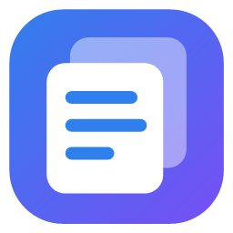

# clipdeck

**Windows için hızlı ve şifreli pano geçmişi, emoji, kaomoji ve sembol seçici.**
Win+V ve Win+. yerine geçer; kopyaladığın her şeyi bulur, temizler, dönüştürür ve imlecin olduğu yere yapıştırır.

[](https://github.com/Talkdedsec/clipdeck/actions/workflows/build.yml)
[](https://github.com/Talkdedsec/clipdeck/actions/workflows/codeql.yml)
[](https://github.com/Talkdedsec/clipdeck/releases/latest)


[](LICENSE)

[**İndir**](https://github.com/Talkdedsec/clipdeck/releases/latest) · [**Web sitesi**](https://talkdedsec.github.io/clipdeck/) · [English](#english)

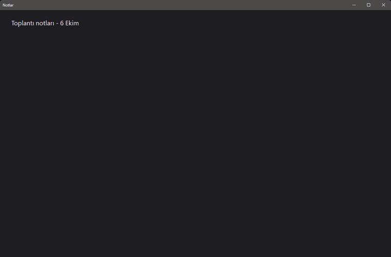

</div>

## Neden clipdeck?

| | Windows Win+V | clipdeck |
| --- | :---: | :---: |
| Geçmişte tutulan öğe | 25 | sınırsız (istersen sınır koy) |
| Yeniden başlatınca | yalnızca sabitlenenler kalır | hepsi kalır |
| Dosya kopyaları | — | ✓ |
| Öğe boyutu | 4 MB'a kadar | 64 MB'a kadar |
| Resimdeki yazıyla arama (OCR) | — | ✓ |
| Büyük önizleme | — | ✓ |
| Değişkenli snippet'ler | — | ✓ |
| Dönüştürerek yapıştırma, link temizleme | — | ✓ |
| Kart, IBAN, token maskeleme | — | ✓ |
| Parolalı, şifreli yedek | — | ✓ |
| Cihazlar arası eşitleme | ✓ (Microsoft hesabıyla) | — (veri bilgisayarında kalır) |

## Özellikler

**Pano geçmişi**
- Metin, resim ve dosya kopyalarını sınırsız ve şifreli olarak saklar; aynı şeyi iki kez kaydetmez.
- Yazdıkça arar; Türkçe karakterlere duyarsızdır (`sifre` → `Şifre`) ve resimlerin içindeki yazıları da bulur (OCR).
- Tür filtreleri (metin, link, resim, dosya, kod, renk kodu, gizli) ve uygulamaya göre filtre.
- Kod parçalarını renklendirir, renk kodlarını (`#hex`, `rgb()`, `hsl()`) örnek renkle gösterir.
- Seçili öğe hedef pencerede imlecin olduğu yere yapıştırılır; düz metin olarak da yapıştırılabilir.
- Büyük önizleme (Space / F3): uzun metin, kod, resim ve OCR metni, dosya boyutları, renk değerleri (HEX/RGB/HSL).
- Çoklu seçim (Ctrl+Space / Ctrl+tık): seçilenleri sırayla birleştirip tek seferde yapıştırır.
- Sabitleme, hızlı yapıştırma (Ctrl+1…9), resimden metin çıkarma (Ctrl+O).
- Dönüştürerek yapıştırma: BÜYÜK/küçük harf, başlık düzeni, boşluk temizleme, tek satır, satır sıralama, tekrarları silme, JSON güzelleştirme/sıkıştırma, URL ve Base64 kodlama/çözme.

**Snippet'ler**
- Sık kullanılan metinleri başlıkla saklar; yapıştırırken değişkenleri doldurur:
  `{tarih}` `{saat}` `{tarihsaat}` `{gün}` `{ay}` `{yıl}` `{pano}` `{guid}` ve imleci yerleştiren `{imleç}`.

**Emoji, kaomoji ve semboller (Win+.)**
- Renkli emoji, Türkçe ve İngilizce arama, ten rengi seçimi, son kullanılanlar.
- Windows fontunun çizemediği emojiler listede gösterilmez.
- Kaomoji `(◕‿◕)` ve Unicode adıyla aranabilen semboller (para birimi, ok, matematik…).

**Gizlilik**
- Geçmiş AES-256-GCM ile şifrelenir; anahtar yalnızca bu Windows hesabıyla açılabilir (DPAPI).
- Parola yöneticilerinin "kaydetme" işaretlerine uyar; seçtiğin uygulamalardan hiç kayıt almaz.
- Kart numarası, IBAN, API anahtarı ve token gibi hassas verileri maskeler ya da hiç kaydetmez.
- Linklerdeki izleme parametrelerini (`utm_`, `fbclid`, `gclid`, `si`…) siler: otomatik, menüden ya da kapalı.
- Kaydı tek tıkla duraklatma, eski öğeleri gün ya da adet sınırıyla otomatik silme.
- Parolalı, şifreli yedek: başka bir bilgisayara taşıyıp geri yükleyebilirsin.
- Varsayılan olarak internete bağlanmaz. İsteğe bağlı güncelleme denetimi açılırsa günde bir kez GitHub'dan yalnızca son sürümün numarasını okur ve yeni sürüm varsa tepsiden haber verir.

**Görünüm ve kullanım**
- Sistem, koyu ya da açık tema; özel vurgu rengi; bulanıklaştırılıp karartılabilen arka plan fotoğrafı.
- Kart saydamlığı ve panel boyutu ayarı; Türkçe ve İngilizce arayüz.
- Yönetici modu: yönetici olarak çalışan programlara da yapıştırabilir.
- Boşta 20 MB civarı bellek; 10.000 öğelik geçmişte bile anında açılır.

## Ekran görüntüleri

| Pano geçmişi | Emoji | Geçmiş |
| --- | --- | --- |
| 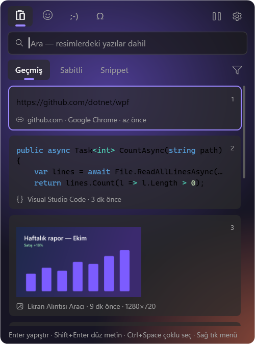 | 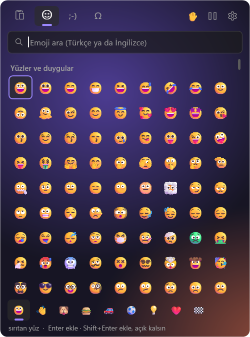 | 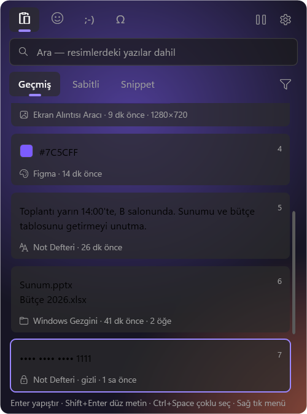 |

| Önizleme |
| --- |
| 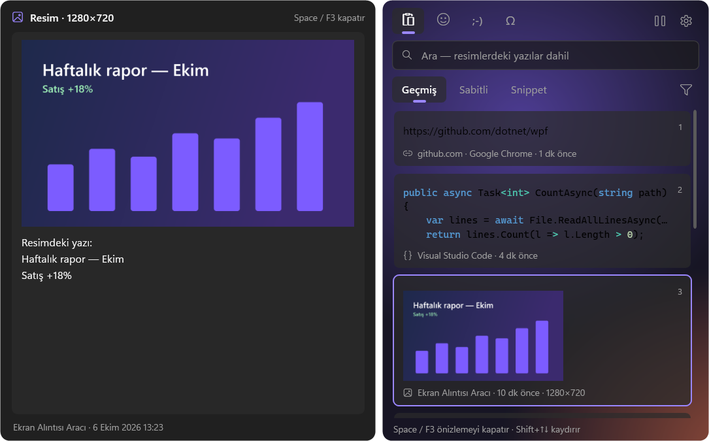 |

| Snippet'ler | Semboller | Ayarlar |
| --- | --- | --- |
| 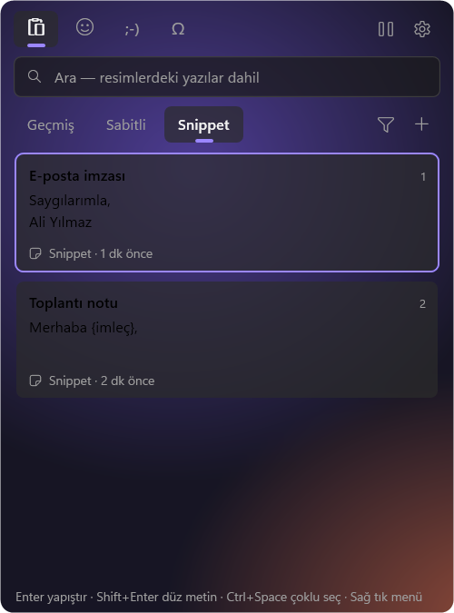 | 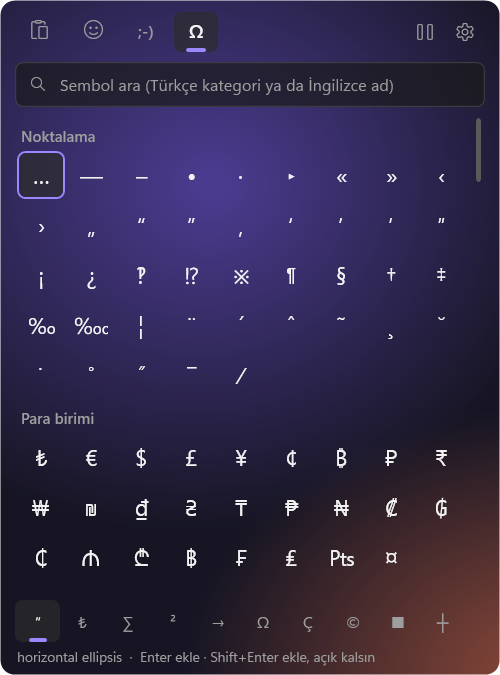 | 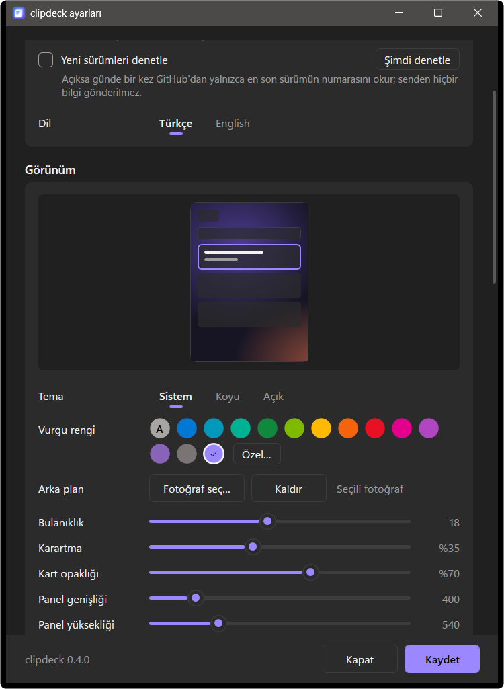 |

## Kurulum

1. [.NET 10 Masaüstü Çalışma Zamanı](https://dotnet.microsoft.com/download/dotnet/10.0)'nı kur (yüklü değilse).
2. [Son sürümden](https://github.com/Talkdedsec/clipdeck/releases/latest) `clipdeck-kurulum.exe` dosyasını indirip çalıştır.
3. Kur'a bas. Yönetici izni gerekmez; program `%LOCALAPPDATA%\Programs\clipdeck` klasörüne kurulur.

Dosya imzasız olduğu için SmartScreen uyarı verebilir: **Ek bilgi → Yine de çalıştır**.

- **Güncelleme:** yeni `clipdeck-kurulum.exe`'yi çalıştırıp Güncelle'ye bas. Pencere açmadan güncellemek için: `clipdeck-kurulum.exe --sessiz`
- **Kaldırma:** Windows Ayarları → Uygulamalar → clipdeck, ya da kurulum dosyasındaki Kaldır düğmesi.
- **Veriler:** `%LOCALAPPDATA%\clipdeck` (şifreli geçmiş, ayarlar, günlük).

## Kısayollar

| Tuş | İş |
| --- | --- |
| Win+V | Pano geçmişini aç / kapat |
| Win+. | Emoji, kaomoji ve semboller |
| Tab / Shift+Tab | Bölüm değiştir (Geçmiş → Sabitli → Snippet → Emoji → Kaomoji → Semboller) |
| Enter / Shift+Enter | Yapıştır / düz metin olarak yapıştır |
| Space, F3 | Önizleme (Shift+↑↓ kaydırır) |
| Ctrl+Space, Ctrl+tık | Çoklu seçim |
| Ctrl+1…9 | Listedeki o sıradaki öğeyi yapıştır |
| Ctrl+P / Ctrl+S / Ctrl+E | Sabitle / snippet yap / snippet düzenle |
| Ctrl+O | Resimden metin çıkar |
| Ctrl+C | Yapıştırmadan sadece panoya kopyala |
| Del | Sil |
| Menü tuşu, Shift+F10, sağ tık | Öğe menüsü (dönüştür, link temizle…) |
| Emoji: oklar, Enter, Shift+Enter | Gez, ekle, ekle ve panel açık kalsın |

## Sık sorulanlar

**Verilerim nerede, başka bilgisayara nasıl taşırım?**
`%LOCALAPPDATA%\clipdeck` klasöründe, şifreli olarak. Anahtar Windows hesabına bağlı olduğu için klasörü kopyalamak yetmez; Ayarlar → Veri → **Yedekle** ile parolalı bir yedek al, diğer bilgisayarda **Geri yükle**.

**Windows'un kendi Win+V'si ne oluyor?**
clipdeck tuşu yakalar; Windows'unki açılmaz. Ayarlarda **Win+V'yi devral** kapatılırsa Windows'unki geri gelir ve clipdeck'i tepsi simgesinden açarsın. Win+. için de ayrı bir seçenek var.

**Parola yöneticisinden kopyaladığım parolalar kaydedilir mi?**
Hayır. Parola yöneticilerinin koyduğu "geçmişe ekleme" işaretine uyulur ve KeePass, Bitwarden, 1Password gibi uygulamalar varsayılan olarak hariç tutulur. Listeyi ayarlardan düzenleyebilirsin.

**Yönetici olarak çalışan bir programa yapıştıramıyorum.**
Windows, normal bir programın yönetici programlara tuş göndermesini engeller. Ayarlar → **Yönetici olarak çalıştır** ile clipdeck de yönetici olarak başlar. Elle açarken UAC onayı istenir; Windows açılınca başlatma ise zamanlanmış görevle, onaysız yapılır.

**Neden .NET çalışma zamanı gerekiyor?**
Böylece program ~29 MB kalıyor; çalışma zamanını içine gömmek boyutu ~190 MB'a çıkarırdı.

## Kaynaktan derleme

Gerekenler: Windows 10 (2004) ya da 11, [.NET 10 SDK](https://dotnet.microsoft.com/download/dotnet/10.0).

```powershell
dotnet build                                             # hata ayıklama derlemesi
dotnet test tests\clipdeck.Tests\clipdeck.Tests.csproj   # testler
.\build.ps1                                              # dist\clipdeck.exe ve dist\clipdeck-kurulum.exe
```

Geliştirirken gerçek geçmişine dokunmamak için `CLIPDECK_DATA` ortam değişkeniyle ayrı bir veri klasörü verebilirsin.
`tests\clipdeck.Tests\LoadSeed.cs` büyük geçmiş yük testi ve tanıtım verisi üretir. Ayrıntılar, kod kuralları ve sürüm çıkarma adımları [katkı rehberinde](CONTRIBUTING.md).

```
App.xaml(.cs)   başlangıç, tek örnek, tepsi, ayarların uygulanması
Core\           pano okuma/yazma, Win+V kancası, SQLite deposu, şifreleme, yedek, OCR, hassas veri, link temizleme
UI\             panel, önizleme, ayarlar, kurulum ve diyalog pencereleri
Native\         Win32 çağrıları
Assets\         simge, emoji verisi (tools\emoji_veri.py ile üretilir), kaomoji ve semboller
tests\          xUnit testleri
docs\           web sitesi (GitHub Pages)
```

## Teşekkürler

- [Microsoft.Data.Sqlite](https://github.com/dotnet/efcore) ve [Vortice.Windows](https://github.com/amerkoleci/Vortice.Windows) (Direct2D ile renkli emoji)
- Emoji adları: [Unicode CLDR](https://cldr.unicode.org/) (Unicode License)
- Metin tanıma: Windows'un yerleşik OCR motoru

## Lisans

[MIT](LICENSE) © 2026 Talkdedsec

[Değişiklikler](CHANGELOG.md) · [Katkı rehberi](CONTRIBUTING.md) · [Güvenlik](SECURITY.md)

---

## English

**clipdeck** is a fast, encrypted clipboard history and emoji / kaomoji / symbol picker for Windows that replaces Win+V and Win+. .

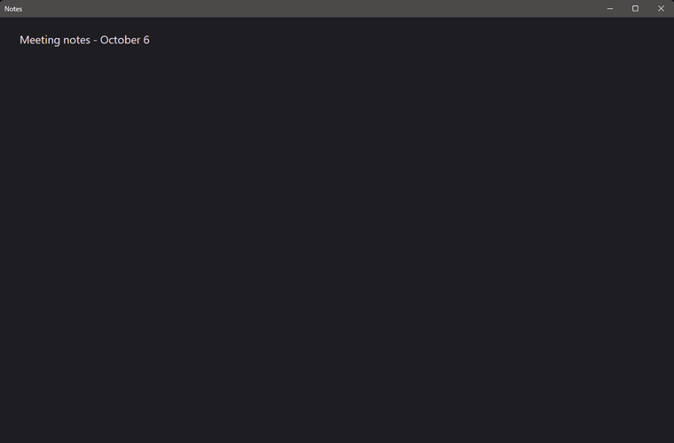

Compared with the built-in Win+V (25 items, cleared on restart except pinned ones, no files, 4 MB per item), clipdeck keeps an unlimited history across restarts, handles files and items up to 64 MB, and adds OCR search, a large preview, snippets, transforms, sensitive-data masking and encrypted backups. It does not sync between devices: your data stays on your PC.

- **Clipboard history:** text, images and files, unlimited and deduplicated; instant search (including text inside images via OCR); type and app filters; code highlighting and colour swatches; large preview (Space / F3); multi-select paste; pinning; Ctrl+1…9 quick paste; paste as plain text or transformed (case, whitespace, sort lines, JSON, URL, Base64).
- **Snippets** with variables: `{date}` `{time}` `{datetime}` `{day}` `{month}` `{year}` `{clipboard}` `{guid}` `{cursor}`.
- **Emoji picker:** colour emoji, Turkish and English search, skin tones, recents, kaomoji and symbols searchable by Unicode name.
- **Privacy:** AES-256-GCM encryption with a DPAPI-protected key; honours password-manager privacy flags; excluded apps; masks or skips card numbers, IBANs and tokens; strips tracking parameters from links (automatic, on demand or off); pause recording; auto-delete by age or count; password-protected encrypted backups; no network access unless you turn on the optional daily update check, which only reads the latest version number from GitHub.
- **Look:** system / dark / light theme, custom accent colour, blurred background photo, card opacity, panel size, Turkish and English UI, admin mode for pasting into elevated apps.

| History | Preview | Settings |
| --- | --- | --- |
| 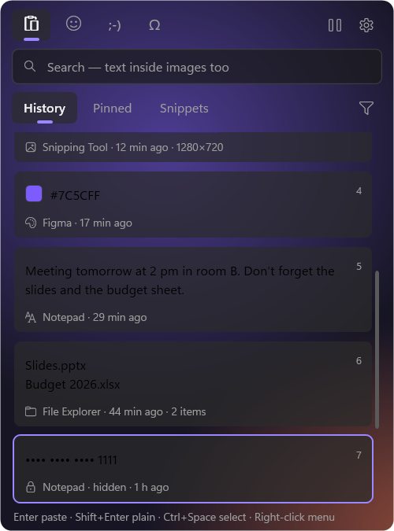 | 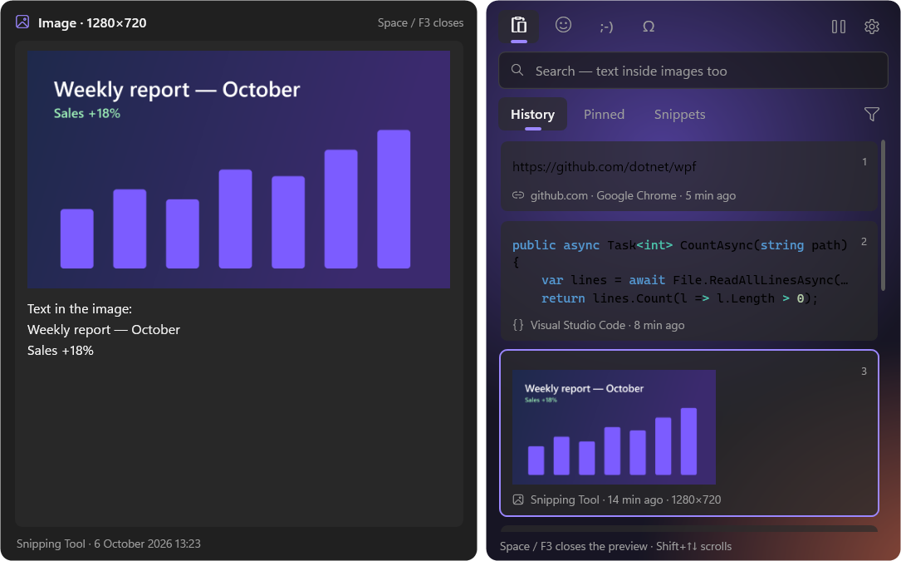 | 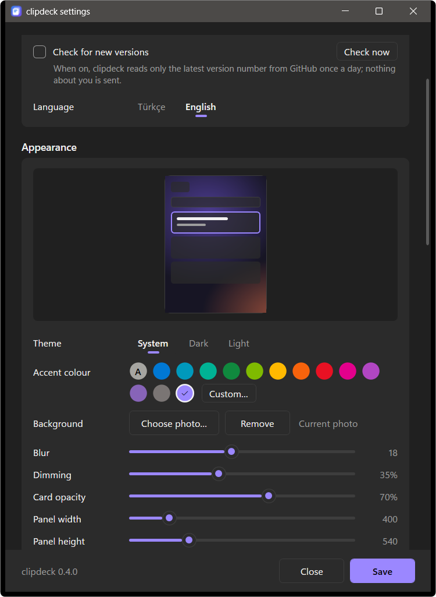 |

**Install:** install the [.NET 10 Desktop Runtime](https://dotnet.microsoft.com/download/dotnet/10.0), download `clipdeck-kurulum.exe` from the [latest release](https://github.com/Talkdedsec/clipdeck/releases/latest) and run it (no admin rights needed). Switch the interface to English under Settings → Language. Silent update: `clipdeck-kurulum.exe --sessiz`.

**Build:** `dotnet build`, `dotnet test tests\clipdeck.Tests\clipdeck.Tests.csproj`, `.\build.ps1`.

**License:** [MIT](LICENSE).
